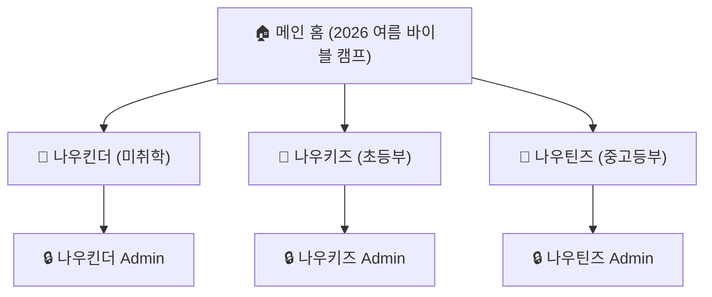
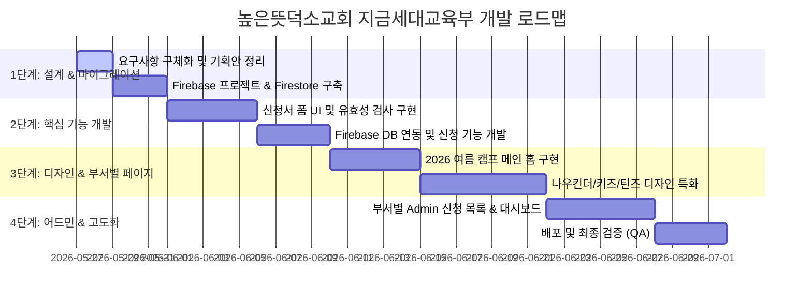

# 높은뜻덕소교회 지금세대교육부 홈페이지 개발 사양서 (Handover Specification)

본 문서는 높은뜻덕소교회 지금세대교육부(미취학, 초등학생, 중고생)의 특별 행사 및 여름 수련회 신청, 일정 관리를 위한 홈페이지 구축 프로젝트의 인수인계 및 개발 계획서입니다.

---

## 1. 프로젝트 개요

*   **프로젝트명**: 높은뜻덕소교회 지금세대교육부 통합 홈페이지
*   **주요 대상**: 미취학(나우킨더), 초등학생(나우키즈), 중고생(나우틴즈) 및 학부모, 교사(관리자)
*   **주요 목적**: 
    *   부서별 행사(수련회, 특별 행사) 신청서 작성 및 관리
    *   연간/월간 주요 일정 확인 및 안내
    *   각 부서별(나우킨더, 나우키즈, 나우틴즈) 맞춤형 공간 제공
*   **메인 테마 (2026)**: **`<2026 여름 바이블 캠프>`**

---

## 2. 기술 스택 & 인프라

*   **Frontend**: 
    *   HTML5 / Vanilla CSS (Modern, Premium, Dynamic UI) / JavaScript (ES6+)
    *   필요에 따라 프레임워크(React/Next.js or Vite) 검토 가능 (현재 단계에서는 빠르고 미려한 반응형 싱글 페이지/멀티 페이지 애플리케이션으로 설계)
*   **Backend & Database**: **Firebase**
    *   **Authentication**: 교사/관리자 로그인 및 신청자 식별
    *   **Firestore Database**: RDBMS 형태로 관계형 데이터를 구조화하여 설계 (Firestore Collection 간 참조 관계 활용)
    *   **Hosting**: Firebase Hosting을 통한 고속/보안 배포
    *   **Storage**: 행사 포스터, 갤러리 이미지 업로드 및 관리

---

## 3. 정보 구조 및 페이지 구성 (Information Architecture)

홈페이지는 메인 페이지(공통)와 3개의 부서별 페이지, 그리고 각 부서에 종속된 관리자(Admin) 페이지로 구성됩니다.



### 3.1. 메인 홈 (Home)
*   **컨셉**: **2026 여름 바이블 캠프**
*   **기능**: 
    *   캠프 소개 및 홍보 배너/비주얼 섹션
    *   부서별(나우킨더, 나우키즈, 나우틴즈) 바로가기 카드 섹션 (각 부서의 아이덴티티를 나타내는 프리미엄 카드 디자인)
    *   통합 캠프 일정 정보 및 D-Day 카운트다운

### 3.2. 부서별 특화 페이지 (나우킨더 / 나우키즈 / 나우틴즈)
*   **나우킨더 (Now Kinder)**: 미취학 아동 및 학부모 대상. 따뜻하고 아기자기한 파스텔톤 디자인.
*   **나우키즈 (Now Kids)**: 초등학생 및 학부모 대상. 활기차고 역동적인 원색/스포티 디자인.
*   **나우틴즈 (Now Teens)**: 중고등부 대상. 감각적이고 트렌디한 다크모드/네온 스타일 디자인.
*   **공통 서브 메뉴**:
    1.  부서 소개 및 비전
    2.  **행사 신청 (핵심 기능)**
    3.  일정 및 공지사항
    4.  활동 갤러리

### 3.3. 부서별 관리자 페이지 (Admin)
*   각 부서의 하위 경로/도메인 형태로 접근 (`/kinder/admin`, `/kids/admin`, `/teens/admin`)
*   **기능**:
    *   행사 등록/수정/삭제
    *   제출된 신청서 목록 조회, 상세 보기, 엑셀/CSV 다운로드
    *   신청 상태 관리 (대기, 확정, 취소) 및 통계 대시보드

---

## 4. [우선 구현] 신청서 작성 기능 요구사항

구글 폼(Google Forms)의 핵심 기능을 홈페이지 내부로 끌어와 교회의 요구에 최적화된 신청서 컴포넌트를 설계합니다.

### 4.1. 제공되어야 할 입력 폼 구성 요소 (구글폼 호환)
1.  **텍스트 입력**: 신청자 이름, 학부모 연락처, 학년/반 등 (단답형 / 장문형)
2.  **선택형 (단일 선택)**: 부서 선택, 셔틀버스 탑승 여부 (라디오 버튼 / 드롭다운)
3.  **다중 선택**: 참석 가능 일자 선택 (체크박스)
4.  **날짜/시간**: 학생 생년월일
5.  **개인정보 수집 및 이용 동의**: 법정대리인 동의 필수 체크박스

### 4.2. 신청서 컴포넌트 추가 특화 기능
*   **유효성 검사 (Validation)**: 연락처 패턴 검사, 필수 항목 미입력 시 시각적 강조 피드백
*   **학부모-자녀 다중 등록 기능**: 한 명의 학부모가 여러 자녀를 연속해서 한 번에 등록할 수 있는 직관적인 UI/UX 제공
*   **실시간 신청 현황 반영**: 선착순 모집일 경우 남은 티켓/인원 실시간 표시

---

## 5. 데이터베이스 설계 (Firebase Firestore Relational Design)

Firestore는 NoSQL이지만, RDBMS 관점의 효율적인 참조 모델로 구성합니다.

### 5.1. `events` (행사 정보)
각 부서의 수련회나 특별 행사 정보를 담는 테이블
```json
{
  "eventId": "event_2026_summer_camp",
  "department": "kids", // kinder, kids, teens
  "title": "2026 여름 바이블 캠프 - 나우키즈",
  "description": "2026년 나우키즈 여름 수련회 신청 페이지입니다.",
  "startDate": "2026-07-25",
  "endDate": "2026-07-27",
  "status": "active", // active, closed, draft
  "createdAt": "2026-05-27T13:14:08Z"
}
```

### 5.2. `applications` (신청서 제출 데이터)
제출된 신청 데이터를 저장하며, `eventId`를 외래 키(Foreign Key)처럼 참조
```json
{
  "applicationId": "app_1029384756",
  "eventId": "event_2026_summer_camp",
  "department": "kids",
  "applicantName": "홍길동",
  "birthDate": "2015-05-15",
  "parentName": "홍판서",
  "parentPhone": "010-1234-5678",
  "attendanceDates": ["2026-07-25", "2026-07-26", "2026-07-27"],
  "shuttleUsage": "yes",
  "tshirtSize": "L",
  "remarks": "알레르기가 있으니 식단 조절이 필요합니다.",
  "privacyConsent": true,
  "submittedAt": "2026-05-28T09:00:00Z",
  "status": "pending" // pending, confirmed, cancelled
}
```

### 5.3. `admins` (부서별 관리자)
관리자 로그인 및 권한 관리를 위한 테이블
```json
{
  "adminId": "admin_user_uid",
  "email": "kids_leader@deokso.org",
  "name": "김전도사",
  "role": "kids_admin", // super_admin, kinder_admin, kids_admin, teens_admin
  "createdAt": "2026-05-27T13:14:08Z"
}
```

---

## 6. 개발 단계별 로드맵



본 문서는 프로젝트 루트 디렉토리에 `project_specification.md`로 영구 저장되며, 이후 개발을 진행할 IDE 에이전트 혹은 팀원이 즉시 참조하여 설계에 반영할 수 있습니다.
